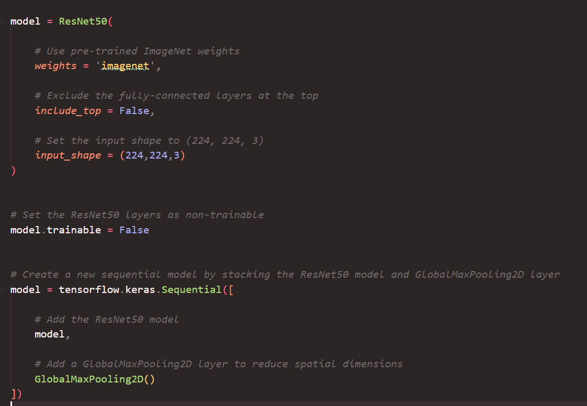
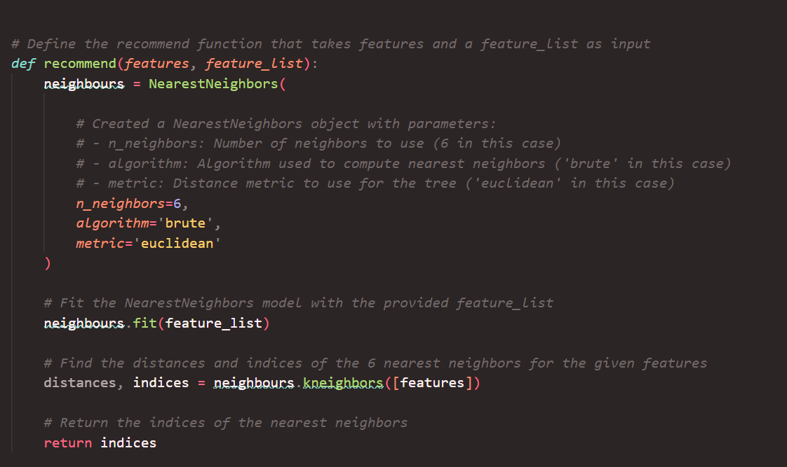
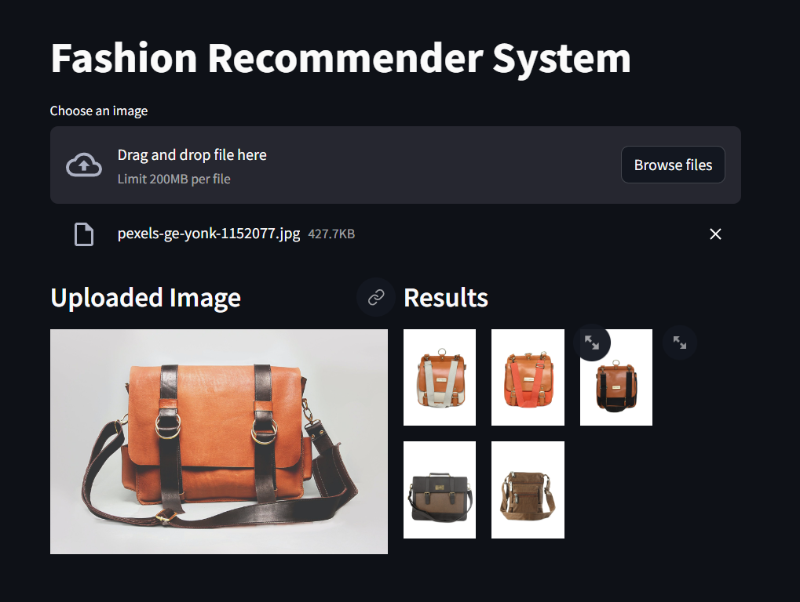

# Fashion Recommendation System

Fashion Recommendation System with Image Recognition is a cutting-edge application designed to provide users with personalized fashion suggestions based on uploaded images. Leveraging advanced deep learning techniques, the system analyzes the features of the uploaded image and retrieves visually similar fashion items from a pre-defined dataset. This project aims to revolutionize the way users discover and explore fashion trends, offering an intuitive and interactive platform for fashion enthusiasts.

### 1. Image Upload

Users can upload images of fashion items they like or wish to explore further. The system accepts various image formats and sizes for seamless interaction.

 

### 2. Feature Extraction

Upon image upload, the system extracts distinctive features using a pretrained ResNet50 model. This process involves converting the image into a numerical feature vector, capturing essential characteristics such as color, texture, and shape.

 

### 3. Recommendation Engine

Based on the extracted features, the system employs a Nearest Neighbors algorithm to find visually similar fashion items from the dataset. Users receive recommendations in real-time, enhancing their browsing experience.

 

### 4. Interactive Interface

The web application provides an intuitive interface for users to visualize both the uploaded image and the recommended items. It offers seamless navigation and responsive design for optimal usability across devices.

 

### 5. Personalization
Over time, the recommendation engine learns from user interactions and refines its suggestions, ensuring personalized recommendations aligned with individual preferences and style.

### 6. Scalability and Performance
The system is designed to handle large-scale datasets efficiently, ensuring robust performance even with extensive image libraries. It can seamlessly integrate with cloud infrastructure for scalability and reliability.

## Conclusion
Fashion Recommendation System with Image Recognition represents a significant advancement in the field of fashion technology, bridging the gap between visual inspiration and actionable recommendations. By harnessing the power of deep learning and recommendation algorithms, the system empowers users to discover new styles, explore trending fashion items, and curate their unique wardrobe effortlessly. With its intuitive interface and personalized approach, the application promises to redefine the fashion shopping experience, making it more engaging, interactive, and enjoyable for users worldwide.
